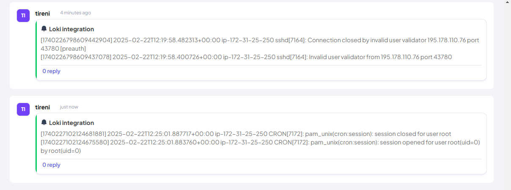

### **Grafana Loki - Telex Integration**  

This project provides an integration between **Grafana Loki** and **Telex**, enabling periodic log retrieval from a Loki server and forwarding the logs to a Telex channel.

---

  **Grafana-Loki Integration**
  

---

## **Features**  
- 📡 **Fetch logs from Loki** at regular intervals  
- 🔍 **Filter logs using Loki queries**  
- 📤 **Send logs to a designated Telex channel**  
- 📊 **Monitor applications or services dynamically**  

---

## **How It Works**  

1. **Telex Configures the Integration**  
   - Calls `GET /integration.json/` to fetch metadata.  
   - Configures Loki Server URL, query, and fetch interval.  

2. **Telex Triggers Log Retrieval (`POST /tick/`)**  
   - Sends a JSON request with:  
     - `channel_id` (Telex channel ID)  
     - `return_url` (URL to send logs)  
     - `settings` (Loki URL, query, etc.)  

3. **The Service Fetches Logs**  
   - Extracts Loki **server URL** and **query** from the request.  
   - Fetches logs from **Loki** for the past **5 minutes**.  

4. **Logs Are Sent to Telex**  
   - `SendLogsToTelex()` sends logs to `return_url`.  
   - Telex receives and processes the logs.  

   **Logs in a channel from the integration**
   

---

## **Endpoints**  

### **1. Get Integration Details**  
📌 **GET `/integration.json/`**  
- Returns metadata about the integration, including name, description, and configuration options.  

### **2. Fetch and Send Logs**  
📌 **POST `/tick/`**  
- Accepts a JSON payload with Loki settings and triggers log retrieval.  

**Request Example:**  
```json
{
  "channel_id": "12345",
  "return_url": "https://telex-webhook.com/logs",
  "settings": [
    {"label": "Loki Server URL", "type": "text", "default": "http://localhost:3100"},
    {"label": "Loki Query", "type": "text", "default": "{job=\"varlogs\"}"}
  ]
}
```

**Response Example:**  
```json
{"status":"success","status_code":202,"message":"request received","task_id":"5e72517e-2418-46f2-bb5b-837422cb7e87"}
```

---

## **Installation & Running Locally**  

### **Prerequisites**  
- **Go 1.18+** installed  
- **Gin Framework** (`github.com/gin-gonic/gin`)  
- **CORS Middleware** (`github.com/gin-contrib/cors`)  

### **1. Clone the Repository**  
```sh
git clone https://github.com/yourusername/grafana-loki-telex.git
cd grafana-loki-telex
```

### **2. Install Dependencies**  
```sh
go mod tidy
```

### **3. Run the Server**  
```sh
go run main.go
```
- The service will be available at `http://localhost:8080`.

---

## **Configuration**  
The integration can be customized using the **settings** field in `POST /tick/`.  
- **Loki Server URL** – The address of the Loki server.  
- **Loki Query** – LogQL query to filter logs.  
- **Interval** – Frequency of fetching logs (supports cron syntax).  

---

## **Project Structure**  
```
📂 grafana-loki-telex/
│── 📁 api/                 # Handles API requests
│── 📁 service/             # Loki querying & log sending logic
│── 📄 main.go              # Entry point of the application
│── 📄 go.mod               # Go dependencies
│── 📄 README.md            # Project documentation
```

---

## **Contributing**  
Pull requests and contributions are welcome! Feel free to open an issue or submit a PR.

---

## **License**  
This project is open-source and available under the **MIT License**.